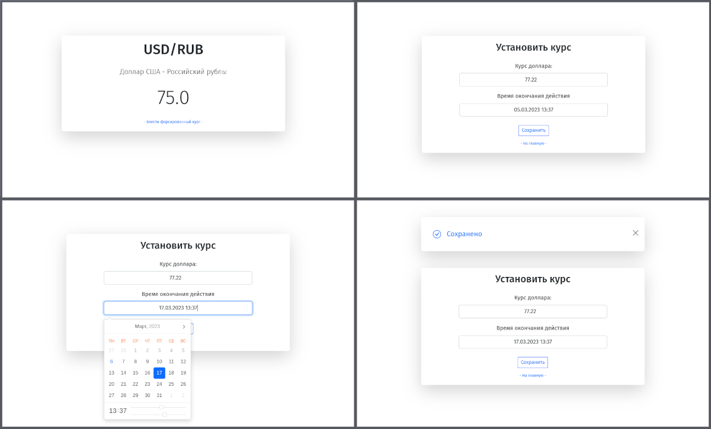

# ExchangeRateNow

Приложение содержит функциональность отображения актуального
курса доллара к рублю.

В качестве актуального курса используется ежедневно обновляемый курс ЦБ РФ, либо 
устанавливаемый вручную форсированный курс. Форсированный курс действует до истечения
установленного срока действия. Все изменения актуального курса на главной странице 
происходят в реальном времени.



### Технологии:

* Ruby/Ruby on Rails

* PostgreSQL

* ActiveJob/Sidekiq/Redis

* ActionCable

* Webpacker/Bootstrap

### Настройка и запуск приложения локально:

###### (Для нормальной работы приложения требуется наличие предустановленных Ruby 2.7.2, PostgreSQL >= 9.3, Redis)

1. Клонировать репозиторий: ```git clone git@github.com:axmaxon/exchange_rate_now```

2. ```cd exchange_rate_now```

3. ```cp config/database.yml.example config/database.yml``` 

4. ```cp .env.example .env```

5. ```editor .env``` отредактируйте имя пользователя и пароль для доступа к вашей базе данных.

5. ```bundle install```

6. ```yarn install```

7. ```rails db:setup```

8. ```editor config/application.rb``` установите ваш часовой пояс: ```config.time_zone = YOUR_TIMEZONE```
   (посмотреть варианты timezones можно с помощью `rails time:zones:all`)

9. Запустить приложение: ```foreman start -f Procfile.dev```
